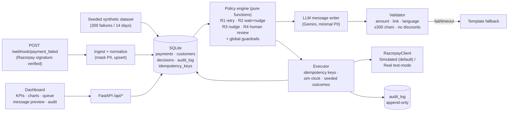

# RecoverAI — Failed-Payment Recovery Agent for Razorpay Merchants

> **Razorpay AI Buildathon — Track: AI Revenue Recovery**
>
> ⚠️ **All demo data and recovery outcomes in this project are SIMULATED** (seeded, synthetic,
> documented assumptions). Nothing here is real merchant data or measured revenue lift.

## Problem statement

Indian merchants lose a meaningful slice of online revenue to failed payments — UPI collect
timeouts, bank downtime, insufficient funds, failed OTP/3DS authentication, customer drop-offs
mid-checkout. Every failure is potentially recoverable money, but recovery today is manual and
crude: merchants either blast every failed payer with the same message (annoying, opt-out risk,
no prioritization, sometimes illegal contact hours) or do nothing. RecoverAI is an agent that
watches failed payments, classifies each failure, and decides **per payment** whether to retry,
wait, nudge the customer with a fresh payment link, or leave it alone — executing only within
hard guardrails (attempt caps, quiet hours, opt-outs, per-day budgets, human approval for high
values) and writing every decision to an append-only audit trail. Deterministic, unit-tested
code makes every money-related decision; the LLM's only job is writing customer-message copy,
and even that output is validated before anything is sent — with a template fallback so the app
works with **no API key at all**.

## Why deterministic code vs. LLM — the split

| Concern | Decided by | Why |
|---|---|---|
| Failure classification (timeout? funds? risk?) | Deterministic rules | Must be explainable, testable, and stable across runs |
| Action choice: retry / wait / nudge / ignore / review | Deterministic policy engine (R1–R4) | Money decisions need guarantees, not probabilities |
| Guardrails (attempt caps, quiet hours, opt-outs, budgets, approvals) | Deterministic code, enforced in the executor | A hard limit must never be "persuadable" by a prompt |
| Queue priority (expected recovered ₹) | Deterministic scoring: amount × recovery probability table | Auditable math, documented in code |
| Customer message copy | LLM (Gemini) → validated → template fallback | Personalization in 3 languages; low stakes, strictly validated |
| Recovery outcomes in the demo | Seeded simulator with documented assumptions | Clearly labeled simulated; no false claims |

## Architecture



## 60-second quickstart

```bash
# 1) clone + enter
git clone <repo-url> recoverai && cd recoverai

# 2) virtualenv (Python 3.11+; tested on 3.11 and 3.13)
python -m venv .venv && source .venv/bin/activate   # Windows: .venv\Scripts\activate

# 3) install
pip install -r requirements.txt

# 4) seed the deterministic demo data + run
make seed && make demo          # → http://localhost:8000
```

No `GEMINI_API_KEY` needed — the app uses the built-in template fallback. Add a key to `.env`
(copy `.env.example`) to see LLM-written messages. Razorpay stays simulated unless you set
**test-mode** keys (`RAZORPAY_KEY_ID` / `RAZORPAY_KEY_SECRET`).

No `make`? Equivalent raw commands: `python -m app.seed --force` and
`python -m uvicorn app.main:app --port 8000`.

## Demo script (60 seconds)

1. **Open the dashboard** — KPI cards: failed ₹, recovered ₹, recovery rate, at-risk ₹, items in human review. All numbers labeled *simulated*.
2. **Point at the chart** — failures by reason (UPI timeouts dominate, like real merchant data) and recovery rate: baseline (do nothing) vs. RecoverAI, on the same seeded payments.
3. **Press "Run agent"** — the deterministic engine classifies every open failure, applies R1–R4 + guardrails, and the prioritized queue fills, sorted by expected recovered ₹ (amount × recovery probability).
4. **Click a queue row** — message preview shows the exact customer message and its source: `LLM` or `template` (with no API key, everything is template).
5. **Approve a human-review item** — every payment ≥ ₹25,000 sits in review until you click Approve; nothing moves without you.
6. **Press "Fast-forward 24h"** — the simulation clock jumps; R2 waits expire, nudges fire, seeded outcomes land (some recover, some don't — documented assumptions), and the audit trail logs every step.
7. **Show the audit trail** — append-only, one row per action, with rule ID, reason, message source, and outcome.
8. **Optional — chaos demo:** restart with `CHAOS=1` (see `.env.example`) and run the agent again; the LLM and Razorpay client fail randomly, nudges fall back to templates, link failures are audited and retried on the next run — the app degrades gracefully instead of crashing.

## Guardrails (enforced in code, unit-tested)

- **R1** technical/transient (UPI timeout, bank error): auto-retry same method after backoff, max 2 retries.
- **R2** insufficient funds: wait 24h, then one nudge with a fresh link offering an alternate method.
- **R3** customer-action failures (wrong OTP, 3DS, cancel): nudge immediately with a fresh link.
- **R4** risk/blocked (suspected fraud, card blocked): never auto-recover; flag for human review.
- Max **3 recovery attempts** per payment, ever.
- **No contact 21:00–08:00 IST** (messages hold until morning).
- **4h cooldown between customer messages** per payment (no nudge spam across agent runs).
- **Opted-out customers are never contacted.**
- **Per-merchant daily message budget** (default 200).
- **Any payment > ₹25,000 requires human approval in the UI** before anything is sent.
- **No discounts, ever** — validator rejects any message implying refunds/discounts.
- Every outbound message is validated (exact amount, exact link, ≤300 chars, correct script); on any LLM error/timeout/bad output → template fallback, `fallback_used=true` logged.
- Append-only audit log with idempotency keys — a payment can never be nudged twice by accident.

## Limitations & honest assumptions

- **Synthetic, seeded data.** The 300 failures are generated with a fixed seed to resemble real merchant failure mixes; they are not real transactions.
- **Simulated recovery outcomes.** Recovery probabilities come from a documented lookup table and a seeded simulator — labeled *simulated* everywhere, never presented as measured lift.
- **Razorpay calls are simulated** by default. `RealRazorpayClient` exists for test-mode keys only and is exercised only if you configure them; no live-mode code paths.
- **Single merchant**, single currency (INR), single demo DB (SQLite). No auth on demo endpoints — it's a buildathon demo, not a production service.
- **PII minimization**: only masked phones (last 4) are stored; the LLM sees first name, amount, language, merchant, link — never phone numbers.
- LLM message quality is guarded by the validator, not by taste; the template fallback is the guaranteed floor.
- Timestamps are epoch seconds stored UTC, business logic (quiet hours, waits) computed in IST.

## What I'd build next

- Real delivery providers (SMS/WhatsApp/email) behind the same executor interface, with delivery receipts feeding outcomes.
- Close the loop: learn per-reason/per-method recovery probabilities from actual outcomes instead of the static table.
- Per-customer frequency caps and cross-payment suppression (one nudge for three failed payments).
- Webhook-driven closure: listen for `payment_link.paid` / `payment.captured` to auto-close recovered payments.
- A/B testing of nudge timing and copy, with the same audit trail.
- Multi-merchant tenancy + role-based approvals for the human-review queue.
- Slack/PagerDuty notifications for R4 human-review items.
- LLM eval harness: golden-message test set, quality scoring, regression gate on prompt changes.

## Repo layout

```
app/
  config.py        # env-driven settings, safe defaults (zero-config demo)
  db.py            # SQLAlchemy engine/session (SQLite)
  models.py        # payments, customers, decisions, audit_log, idempotency_keys
  clock.py         # simulation clock (fast-forward support)
  utils.py         # PII masking, IST time helpers
  seed.py          # seeded synthetic dataset generator
  ingest.py        # webhook -> normalized rows (replay-safe)
  webhooks.py      # Razorpay webhook payload models + signature verification
  razorpay/        # client interface + simulated + real (test-mode) clients
  policy/          # Phase 2: classification, rules, guardrails, priority
  llm/             # Phase 3: writer, validator, templates
  executor.py      # Phase 4: runs approved actions, audit trail, outcomes
  main.py          # FastAPI app + webhook endpoint
static/index.html  # Phase 5: dashboard (Tailwind CDN + Chart.js)
tests/             # Phase 1/2/3/4/6 pytest suites
data/              # SQLite DBs (gitignored)
```
